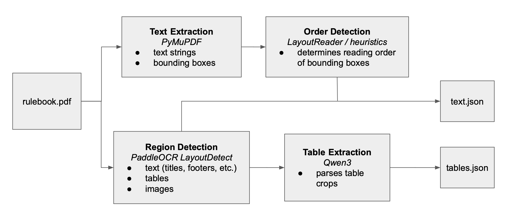
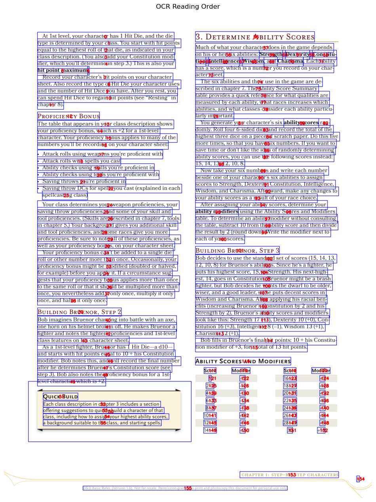
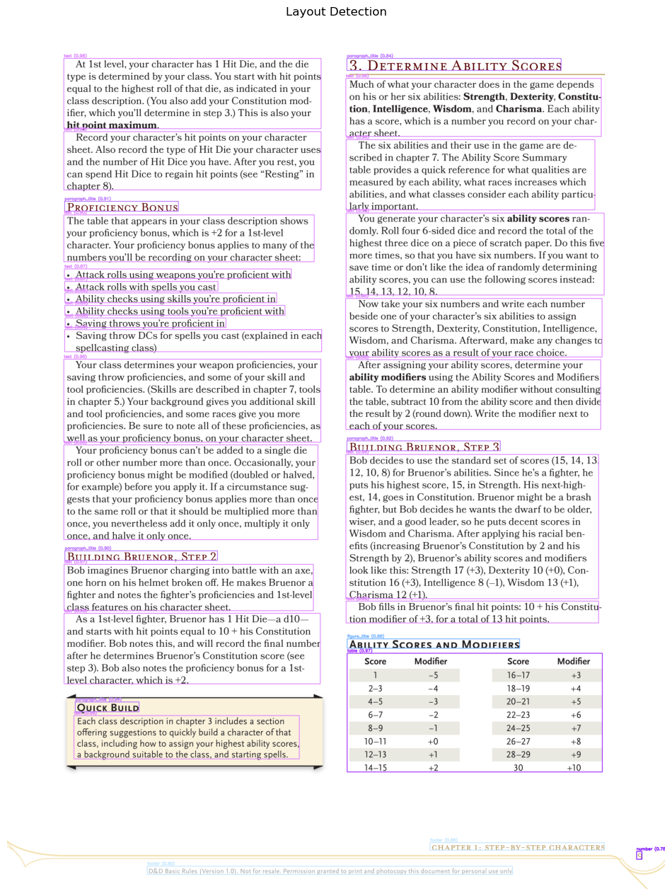

# D&D Rulebook Parser

An end-to-end document extraction pipeline that converts a Dungeons & Dragons [rulebook](https://www.google.com/url?sa=t&source=web&rct=j&opi=89978449&url=https://media.wizards.com/2018/dnd/downloads/DnD_BasicRules_2018.pdf&ved=2ahUKEwj74_m4l5iSAxVAnf0HHXdFM3YQFnoECBgQAQ&usg=AOvVaw089RBmBIdITuY2icvBIOKk) PDF into structured data suitable for search, embedding, and downstream analysis.

The pipeline handles layout detection, reading order reconstruction, table extraction, and semantic structuring of the book’s contents.

## Notebooks

`ingest.ipynb` runs the full ingestion pipeline, from raw PDF pages to structured JSON outputs.

<p align="center">
    
</p>


`inspect.ipynb` provides visual diagnostics and debugging tools for intermediate steps in the pipeline, including reading order reconstruction and layout detection.

<p align="center">
    
    
</p>

## Installing Dependencies

```
$ conda env create -f environment.yaml
$ conda activate dnd-rulebook
```
